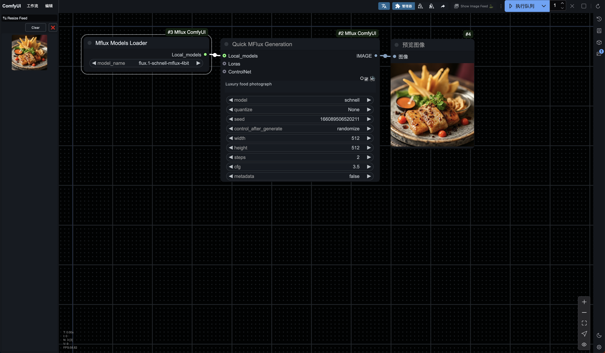
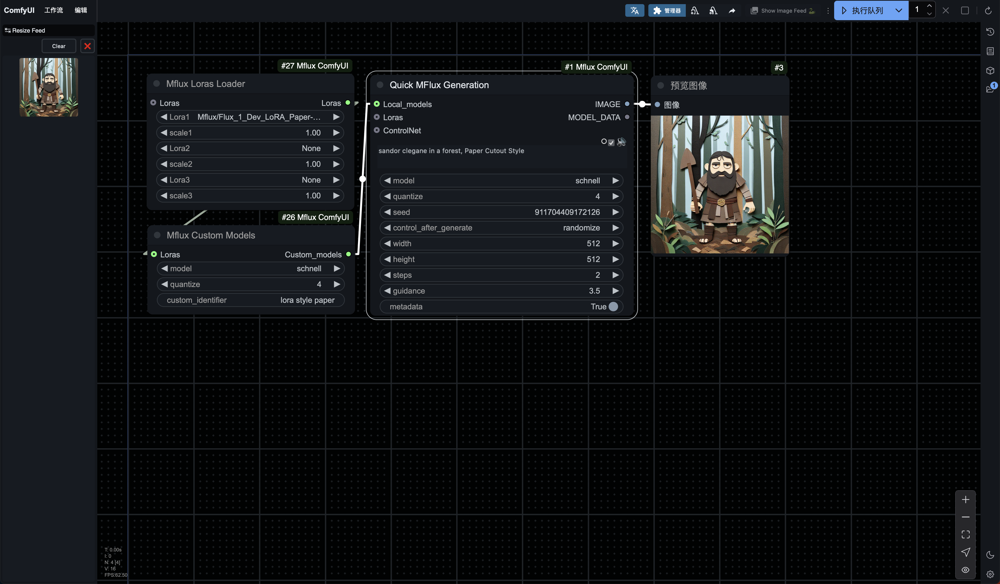

<h1 align="center">Quick Mflux on Comfyui</h1>

      English | <a href="README_zh.md">中文</a>

# Quick Mflux on Comfyui

## Introduction
Simple use of Mflux in ComfyUI, suitable for users who are not familiar with terminal usage. Only for MacOS.

## Acknowledgements

Thanks to the developers of the [**mflux**](https://github.com/filipstrand/mflux) project, especially the initiator **@filipstrand** and active contributor **@anthonywu**, for making it easier and more efficient for Mac users to generate flux model images. These contributions are truly delightful—thank you!

mflux:  
https://github.com/filipstrand/mflux

Thanks also to **@CharafChnioune**, the author of [**MFLUX-WEBUI**](https://github.com/CharafChnioune/MFLUX-WEBUI), from whom I partially referenced some code. In compliance with the Apache 2.0 license used in his project, I have added license comments in the referenced sections of my code.

## Installation Guide
1. `cd /path/to/your_ComfyUI`
2. Activate the virtual environment
3. `cd custom_nodes`
4. `git clone https://github.com/raysers/Mflux-ComfyUI.git`
5. `pip install mflux==0.3.0`
6. Restart ComfyUI

Alternatively, you can search for "Mflux-ComfyUI" in ComfyUI-Manager for a quick installation.

## Update Announcement

**About This Update:**

1. Restored the Huggingface auto-download feature that was previously removed, enabling users to directly download the existing Mflux 4-bit models.
   
   Based on the discussions in issue #04, an 8-bit version has been added to address the difficulty of manual downloads. Now, all quantized models can be downloaded directly through the **Mflux Models Downloader** node.

   Here are the manual download links for all quantized versions:

   - [madroid/flux.1-schnell-mflux-4bit](https://huggingface.co/madroid/flux.1-schnell-mflux-4bit)
   - [madroid/flux.1-dev-mflux-4bit](https://huggingface.co/madroid/flux.1-dev-mflux-4bit)
   - [AITRADER/MFLUX.1-schnell-8-bit](https://huggingface.co/AITRADER/MFLUX.1-schnell-8-bit)
   - [AITRADER/MFLUX.1-dev-8-bit](https://huggingface.co/AITRADER/MFLUX.1-dev-8-bit)

2. I have attempted to complete the final piece of the puzzle for Mflux 0.3.0, which allows users to save their exclusive models. With this feature, as long as you have the complete native Black Forest model saved in your `.cache`, you can customize your own exclusive model by setting parameters. This makes downloading less necessary, as you can create it yourself.

**Previous Update:**

The LORA storage path in ComfyUI is **models/loras**, and LORA files need to be manually placed in this directory. The **Mflux Loras Loader** node will automatically search for them.

I typically create a folder named Mflux under **models/loras** to keep track of the compatible LORAs for Mflux, thus unifying storage. Therefore, in my node, the retrieved files should appear as Mflux/*******.safetensors.

**Important Note:**

If you don't have a strong need for Lora, it is still recommended to continue using the previous 4BIT quantized model. As long as it remains in the old version's preset path in the "**models/Mflux**" directory, you can freely choose it from the **Mflux Models Loader** node list.

Additionally, this update covers nearly all loading methods for models, allowing users with various needs to use models freely. I personally recommend the 4-bit Schnell 2-step, which achieved over 20+ seconds of raw image generation on my M1 Pro 16GB.

## Usage Instructions

Right-click to create nodes:

Under **Mflux/Air**:

- **Quick MFlux Generation**  
- **Mflux Models Loader**
- **Mflux Models Downloader**
- **Mflux Custom Models**

Under **Mflux/Pro**:

- **Mflux Loras Loader**  
- **Mflux ControlNet Loader**

Or double-click in the blank area of the canvas to bring up the node search box, and directly search for the node names by the keyword “Mflux.”

### Process

**Mflux Air:**

This process will download the full version of dev or schnell to `.cache` from Huggingface.

Alternatively, the external node can be used to continue loading the quantized models, such as:

Alternatively, you can directly connect to the **Mflux Models Downloader** node to download 4-bit models from Hugging Face, for example:

Alternatively, you can create your exclusive model using the full version of the Black Forest model through **Mflux Custom Models**:

For instance, the default quantized version, which is the same as the basic quantized model downloaded from Hugging Face:

Or the LORA overlay version, which allows you to apply LORA before quantization, making the model a unique version:

The downside of this LORA customized model is that it fundamentally remains a quantized model. If you want to continue stacking LORAs in **Quick MFlux Generation**, it will throw an error.

However, if you wish to quickly generate multiple images of the same LORA style and your machine configuration isn’t very high, like my 16GB, then using this method can serve as a compromise for implementing LORA. Once the raw images are completed, you can directly delete this unique model.

**Note**

Whether downloading models from Hugging Face or creating custom exclusive models, they only need to be run once. As long as you save the model, you can use the **Mflux Models Loader** node to retrieve them.

The **custom_identifier** in the **Mflux Custom Models** node is not a required field. If you don’t need a specific identifier for differentiation, you can leave it blank.

## **Mflux Pro:**

### Loras:

The image uses two **Mflux Loras Loader** nodes just to illustrate that they can be chained together, meaning you can theoretically load countless Loras...

Note that when using LORA, you can also use the **Mflux Models Loader** node to load local models, but it is limited to full version models. If you select a quantized model from the model list, it will throw an error.

### ControlNet:

Mflux's ControlNet currently only supports Canny.

## **Mflux Plus:**

A must-have for English beginners.

Image reverse generation, using the MiaoshouAI/Florence-2-large-PromptGen-v1.5 visual model here.

All these processes can be dragged directly into ComfyUI from the workflows folder.

!!! If nodes are highlighted in red, use ComfyUI-Manager's "One-click Install Missing Nodes."
!!! Please note that all processes at the end use preview nodes, which do not automatically save. You need to manually save the generated images you are satisfied with or simply replace the preview nodes with save nodes.

In the **Quick MFlux Generation** node, if the metadata option is set to true (default is false), the generated images will be saved to **ComfyUI/output/Mflux**, along with a JSON file with the same name as the image, which contains almost all the generation parameters for that image.
I personally prefer to keep metadata set to true and connect to the preview node instead of the save node. The advantage of this approach is that it avoids duplicate saves, and if you need to retrieve information about a certain image in the future, you can check directly in the JSON file, making it easy to replicate the image.
Thus, in this update, metadata is set to true by default, and it can be turned off with just one click.

### **Possible Explorations**

## **Mflux MAX:**

......

## **Mflux Ultra:**

......

Here, I hope everyone shares their workflows more, fully promoting the spirit of sharing on the internet. Knowledge for payment? No, I advocate cooperation and sharing for mutual benefit.

## **Planning**

The complete functionality of Mflux 0.3.0 has been accomplished. Please keep an eye on the official website for updates:

[https://github.com/filipstrand/mflux](https://github.com/filipstrand/mflux)

While completing these tasks for Mflux 0.3.0, I awarded myself a star. Even beginner projects need encouragement.

## **Contribution**

I am a novice coder, and this is my first GitHub project. My original plan was quite ambitious, such as implementing Lora and ControlNet functionalities for Mflux (currently, only Mflux ControlNet supports Canny and Lora), as well as realizing the essence of ComfyUI—splitting nodes to allow users to understand the underlying logic of flux deeply... However, my limited coding ability restricts my blueprint. I would be very grateful if experts could help realize these goals. Greetings here.

Other contributions should include issue feedback, as I was surprised to find that this project has had zero feedback up to now, and I occasionally overlook problems. For example, I previously lost the “}” symbol and encountered an error where the models/Mflux directory was not automatically created. Additionally, I found a feedback on the ComfyUI official website indicating that OS15 might not be usable.

The resolution for the missing “}” symbol was thanks to @eLenoAr’s timely reminder. Although it wasn’t through the issues channel, I also appreciate @eLenoAr's feedback in the code comments.

## License

I would like to adopt the MIT License consistent with the Mflux project, contributing my part to the open-source community.
