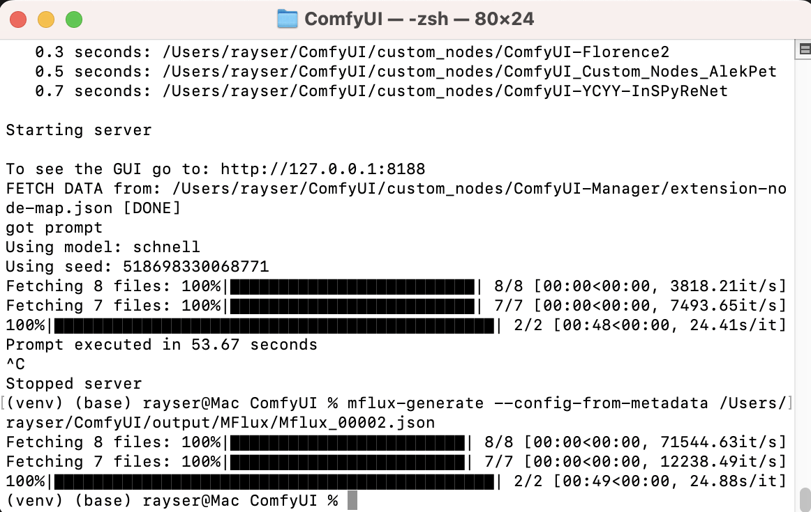
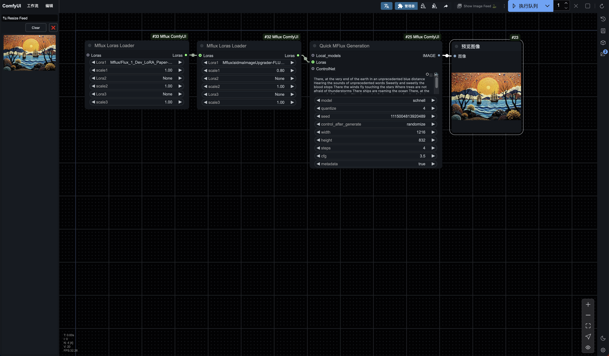

<h1 align="center">Quick Mflux on Comfyui</h1>

      English | <a href="README_zh.md">中文</a>

# Quick Mflux on Comfyui

## Introduction
Simple use of Mflux in ComfyUI, suitable for users who are not familiar with terminal usage. Only for MacOS.

## Acknowledgements

Thanks to the developers of the [**mflux**](https://github.com/filipstrand/mflux) project, especially the initiator **@filipstrand** and active contributor **@anthonywu**, for making it easier and more efficient for Mac users to generate flux model images. These contributions are truly delightful—thank you!

mflux:  
https://github.com/filipstrand/mflux

Thanks also to **@CharafChnioune**, the author of [**MFLUX-WEBUI**](https://github.com/CharafChnioune/MFLUX-WEBUI), from whom I partially referenced some code. In compliance with the Apache 2.0 license used in his project, I have added license comments in the referenced sections of my code.

## Installation Guide
1. `cd /path/to/your_ComfyUI`
2. Activate the virtual environment
3. `cd custom_nodes`
4. `git clone https://github.com/raysers/Mflux-ComfyUI.git`
5. `pip install mflux==0.4.1`
6. Restart ComfyUI

Alternatively, you can search for "Mflux-ComfyUI" in ComfyUI-Manager for a quick installation.

## Update Announcement

### **About This Update:**

- Bring Back the Missing Metadata

The **Quick MFlux Generation** node has its `metadata` option set to `True` by default. This ensures that generated images are automatically saved to **ComfyUI/output/Mflux**, along with a JSON file named identically to the image.

Some Explanations:

Q: Why go to such lengths to add so much code for this feature? Is it worth it?  
A: **This feature ensures compatibility with the official version of MFlux. The JSON files saved by ComfyUI can also be directly used to recreate images in the official MFlux version.**

Q: If ComfyUI is already convenient, why use the official version? 
A: Because I’m not a professional developer. The current ComfyUI version might have several limitations, such as high memory usage. For example, my 16GB RAM consistently shows 13–14GB usage when running ComfyUI. On the other hand, the official MFlux version has an excellent memory recycling mechanism. In my tests, after image generation, the official version consistently frees up memory and maintains a low usage level. Moreover, previous issues with terminal-based operations have been significantly improved, thanks to the introduction of the **--config-from-metadata** command in MFlux 0.4.X. This greatly simplifies the parameters needed for image generation.

Q: How can I use the official MFlux version within the ComfyUI directory and generate images with `--config-from-metadata`? 
A:
Follow these steps:
1. `cd /path/to/your_ComfyUI`
2. Activate the virtual environment.
3. Run:  
   `mflux-generate --config-from-metadata /Users/XXXXX/ComfyUI/output/MFlux/Mflux_XXXXX.json`

**Example:**  

*P.S.: To generate the above example image, I terminated the ComfyUI process using `control+c`, then used the `mflux-generate --config-from-metadata` method. You can directly modify the JSON parameters to obtain different image outputs.*

Q: Can JSON-based recreation also work within ComfyUI?**  
A: Yes, ComfyUI has its own method. Simply drag and drop the saved image into the workflow. Images saved in **ComfyUI/output/Mflux** embed the workflow directly, so they can be used in ComfyUI without additional steps.

---

- Images can be directly dragged into ComfyUI for reuse.  
- JSON files can be loaded into the official mflux version.  

In my view, this approach combines the best of both worlds.

---

### **Previous Updates Recap:**

- Added progress bar and interruption functionality in ComfyUI. Click the built-in cancel button (the cross icon) to interrupt.  
- Customizable file paths.  
- Image-to-Image generation.

mflux has been updated to version 0.4.1. To experience image-to-image generation, please upgrade in ComfyUI with:

`pip install --upgrade mflux`

## Usage Instructions

Right-click to create nodes:

Under **MFlux/Air**:

- **Quick MFlux Generation**  
- **MFlux Models Loader**
- **MFlux Models Downloader**
- **MFlux Custom Models**

Under **MFlux/Pro**:

- **MFlux Load Image**
- **MFlux Loras Loader**  
- **MFlux ControlNet Loader**

Or double-click in the blank area of the canvas to bring up the node search box, and directly search for the node names by the keyword “Mflux.”

### Basic Path Explanation

Quantized Models:

**ComfyUI/models/Mflux**

LoRA:

**ComfyUI/models/loras**

I usually create an **Mflux** folder under **models/loras** to manage the LoRAs compatible with Mflux, storing them uniformly. Therefore, in my example, the retrieved files should be Mflux/*******.safetensors.

Native Full Models & ControlNet:

**Yourusername/.cache**

Although the current node **Mflux Models Downloader** can automatically download, I would still like to share a few links to quantized models as a token of appreciation:

- [madroid/flux.1-schnell-mflux-4bit](https://huggingface.co/madroid/flux.1-schnell-mflux-4bit)
- [madroid/flux.1-dev-mflux-4bit](https://huggingface.co/madroid/flux.1-dev-mflux-4bit)
- [AITRADER/MFLUX.1-schnell-8-bit](https://huggingface.co/AITRADER/MFLUX.1-schnell-8-bit)
- [AITRADER/MFLUX.1-dev-8-bit](https://huggingface.co/AITRADER/MFLUX.1-dev-8-bit)

Of course, there are also the most important native full models from Black Forest:

- [black-forest-labs/FLUX.1-schnell](https://huggingface.co/black-forest-labs/FLUX.1-schnell)
- [black-forest-labs/FLUX.1-dev](https://huggingface.co/black-forest-labs/FLUX.1-dev)

Additionally, here is the FLUX.1-dev-Controlnet-Canny model from the InstantX team:

- [InstantX/FLUX.1-dev-Controlnet-Canny](https://huggingface.co/InstantX/FLUX.1-dev-Controlnet-Canny)

## Workflow

### **Mflux Air:**

#### text2img:

This basic workflow will download the full versions of dev or schnell to `.cache` from Hugging Face, both of which are over 33GB and may put a strain on hard drive space.

I personally have installed the entire ComfyUI directly on an external hard drive, and I also set the HF_HOME variable to move the `.cache` directory to the external hard drive to avoid running out of disk space.

Of course, using quantized models will greatly save hard drive space. If you want to use quantized models, you can directly connect to the **Mflux Models Downloader** node to download quantized models from Hugging Face, such as:

Alternatively, you can use the full version of the Black Forest model that is pre-existing in `.cache` to create your custom model through **Mflux Custom Models**:

For instance, the default quantized version, which is the same as the basic quantized model downloaded from Hugging Face:

Or the LoRA stacked version, which allows for quantization after stacking LoRAs, thereby creating a unique model:

The drawback of this LoRA custom model is that it essentially remains a quantized model. If you try to stack LoRAs again in **Quick MFlux Generation**, it will result in an error.

Here, we can extract a mutual exclusion rule: LoRAs and quantized models cannot be used simultaneously; you can only choose one. To achieve the best of both worlds, you can only generate a LoRA custom model through this pre-quantization stacking.

However, if you want to quickly generate multiple images in the same LoRA style and your machine configuration is not very high (for example, mine has 16GB), using this method can serve as a compromise for achieving LoRA results. You can delete this unique model once the generation is complete.

Note that the `custom_identifier` in the **Mflux Custom Models** node is not a mandatory field. If you do not need a specific identifier for distinction, you can leave it empty.

Whether you are downloading models from Hugging Face or creating custom models, they only need to be **run once**. As long as you save the model, you can use the **Mflux Models Loader** node to retrieve them, such as:

This update also adds the option to manually input paths. Alternatively, you can clear the **models/Mflux** folder, which will show "NONE" in the selection list, and then you can enter your own model path in `free_path`.

#### img2img:

I am still exploring the specific usage methods. If you have experiences worth sharing, please feel free to start a discussion in the issues.

### **Mflux Pro:**

#### Loras:

In the image, two **Mflux Loras Loader** nodes are used just to illustrate that they can be chained together, meaning you can theoretically load countless LoRAs...

Please note that you cannot use the **Mflux Models Loader** node to load quantized models when using LoRAs; doing so will result in an error. This further verifies the mutual exclusion rule mentioned above.

Perhaps one day the official team will resolve this error; let's wait patiently.

Note:

Not all LoRAs are compatible with Mflux. Please check the official homepage for specific compatible types:

https://github.com/filipstrand/mflux

Therefore, I typically create an **Mflux** folder under **models/loras** to store all LoRAs compatible with Mflux in one place.

#### ControlNet:

Mflux's ControlNet currently only supports Canny.

P.S. To quickly generate example images, I created a custom model using a 4-step LoRA from the dev model.

The advantage of this 4-step LoRA model is that it still belongs to the DEV model, so the Guidance parameter can be effective, and it can produce images in just four steps while retaining the advantages of schnell.

### **Mflux Plus:**

A must-have for English beginners.

Image reverse generation, using the MiaoshouAI/Florence-2-large-PromptGen-v1.5 visual model here.

All these processes can be dragged directly into ComfyUI from the workflows folder.

!!! If nodes are highlighted in red, use ComfyUI-Manager's "One-click Install Missing Nodes."
!!! Please note that all processes at the end use preview nodes, which do not automatically save. You need to manually save the generated images you are satisfied with or simply replace the preview nodes with save nodes.

### **Possible Explorations**

#### **Mflux MAX:**

......

#### **Mflux Ultra:**

......

Here, I hope everyone shares their workflows more, fully promoting the spirit of sharing on the internet. Knowledge for payment? No, I advocate cooperation and sharing for mutual benefit.

## **Planning**

Official Website Overview of Mflux 0.4.x Features:

- Img2Img Support: Introduced the ability to generate images based on an initial reference image.
- Image Generation from Metadata: Added support to generate images directly from provided metadata files.
- Progressive Step Output: Optionally output each step of the image generation process, allowing for real-time monitoring.

Previous updates have already completed the Img2Img functionality. Additionally, MFlux 0.4.x introduced a keyboard interruption feature, which was implemented in the last update using ComfyUI's cancel button.

This update focuses on completing the functionality to generate images from metadata.

The next step is to complete the implementation of the remaining features as much as possible.

Please pay attention to the official website：

[https://github.com/filipstrand/mflux](https://github.com/filipstrand/mflux)

## **Contribution**

Interactive communication is all a contribution.

## License

I would like to adopt the MIT License consistent with the Mflux project, contributing my part to the open-source community.
