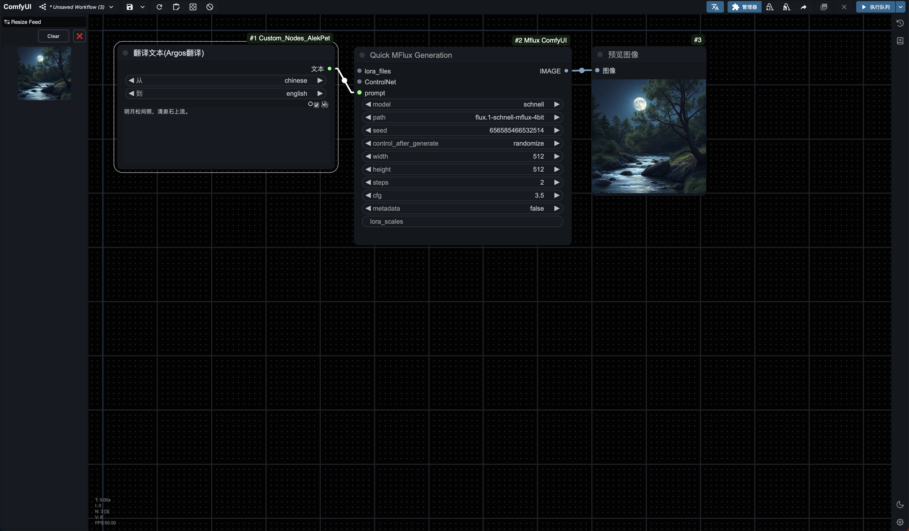

<h1 align="center">Quick Mflux on Comfyui</h1>

      English | <a href="README_zh.md">中文</a>

# Quick Mflux on Comfyui

## Introduction
Simple use of Mflux in ComfyUI, suitable for users who are not familiar with terminal usage. Only for MacOS.

## Acknowledgements

Thanks to the developers of the [**mflux**](https://github.com/filipstrand/mflux) project, especially the initiator **@filipstrand** and active contributor **@anthonywu**, for making it easier and more efficient for Mac users to generate flux model images. These contributions are truly delightful—thank you!

mflux:  
https://github.com/filipstrand/mflux

Thanks also to **@CharafChnioune**, the author of [**MFLUX-WEBUI**](https://github.com/CharafChnioune/MFLUX-WEBUI), from whom I partially referenced some code. In compliance with the Apache 2.0 license used in his project, I have added license comments in the referenced sections of my code.

## Installation Guide
1. `cd /path/to/your_ComfyUI`
2. Activate the virtual environment
3. `cd custom_nodes`
4. `git clone https://github.com/raysers/Mflux-ComfyUI.git`
5. `pip install mflux==0.3.0`
6. Restart ComfyUI

Alternatively, you can search for "Mflux-ComfyUI" in ComfyUI-Manager for a quick installation.

## Update Statement

The storage path for ComfyUI's Loras is models/loras, and you need to manually place the LORA files into this directory. The Mflux Loras Loader node will automatically retrieve them.

My habit is to create a folder named Mflux under models/loras to store the LORAs compatible with Mflux, so that they are uniformly stored there. Therefore, in my nodes, the retrieved files should be Mflux/*******.safetensors.

**Please note:**

This update redesigns the model loading and quantization mechanism to support Lora, keeping it consistent with the official Mflux, using the full model + quantization parameters. This may require downloading dozens of gigabytes of the native Black Forest FLUX model from Huggingface, which might burden some users.

This is currently a necessary measure to implement the Lora functionality, as Lora only works with the full version of the weights. Using a quantized model will cause errors, and there’s no way around it.

To avoid wasting resources by downloading repeatedly, if you already have the full FLUX model in ComfyUI, you can move the model to the "**models/Mflux**" directory and use the **Mflux Models Loader** node to load it, allowing you to bypass the download process.

Of course, if you don't have a strong need for Lora, it is still recommended to continue using the previous 4BIT quantized model. As long as it remains in the old version's preset path in the "**models/Mflux**" directory, you can freely choose it from the **Mflux Models Loader** node list.

Here are the manual download links for the 4BIT version:

- [madroid/flux.1-schnell-mflux-4bit](https://huggingface.co/madroid/flux.1-schnell-mflux-4bit)  
- [madroid/flux.1-dev-mflux-4bit](https://huggingface.co/madroid/flux.1-dev-mflux-4bit)

## Usage Instructions

Right-click to create nodes:

Under **Mflux/Air**:

- **Quick MFlux Generation**  
- **Mflux Models Loader**

Under **Mflux/Pro**:

- **Mflux Loras Loader**  
- **Mflux ControlNet Loader**

Or double-click in the blank area of the canvas to bring up the node search box, and directly search for the node names by the keyword “Mflux.”

### Process

**Mflux Air:**

This process will download the full version of dev or schnell to .cache from Huggingface.

If your full version of dev or schnell has already been moved to models/Mflux, connecting an **Mflux Models Loader** and selecting your full version of dev or schnell will not trigger a download and will use your local full version model directly.

Alternatively, the external node can be used to continue loading the 4BIT quantized model, such as:

**Mflux Pro:**

In the image, two **Mflux Loras Loader** nodes are used just to illustrate that they can be chained together, meaning, theoretically, you can load countless Loras...

Note that when using Lora, you can also load local models with the **Mflux Models Loader** node, but only for full version models. If a quantized model is selected in the model list, it will cause an error.

Mflux's ControlNet currently only supports Canny.

**Mflux Plus:**

Essential for English beginners.

Image feedback and regeneration; here, the MiaoshouAI/Florence-2-large-PromptGen-v1.5 visual model is used.

All of the above processes can be directly dragged from the workflows folder into ComfyUI.

！！！If nodes are showing red, use ComfyUI-Manager's "One-click Install Missing Nodes."  
！！！Please note that all nodes at the end of the process are preview nodes and will not be saved automatically. You need to manually save the generated images that you are satisfied with or simply replace the preview nodes with save nodes.

In the **Quick MFlux Generation** node, if the metadata option is true (default is false), the generated images will be saved to **ComfyUI/output/Mflux** along with a json file with the same name, containing almost all the generation parameters of that image.  
I personally prefer to turn metadata on, connecting it to a preview node instead of a save node. The advantage is that it won't save duplicates, and if I need to retrieve information about a certain image later, I can refer directly to the json file, making it easy to replicate the image.

### Possible Exploration

**Mflux MAX:**

......

**Mflux Ultra:**

......

I hope experts can share more workflows and contribute to the open-sharing spirit of the internet. Paid knowledge? No, I advocate for open sharing.

## Planning

The next goal is the final piece of the Mflux puzzle: saving exclusive models.

## Contribution

I am a beginner coder, and this is my first GitHub project. My original plan was quite ambitious, such as implementing Lora and ControlNet functionality for Mflux (currently, Mflux ControlNet only supports Canny, and Lora is available) and realizing the essence of ComfyUI — that is, splitting nodes so users can delve into the underlying logic of FLUX... but my limited coding skills have constrained my vision. I would be very grateful if someone skilled could help realize these plans. Greetings to all here.

## License

I would like to adopt the MIT License consistent with the Mflux project, contributing my part to the open-source community.
