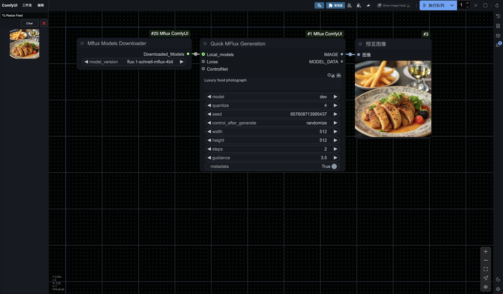
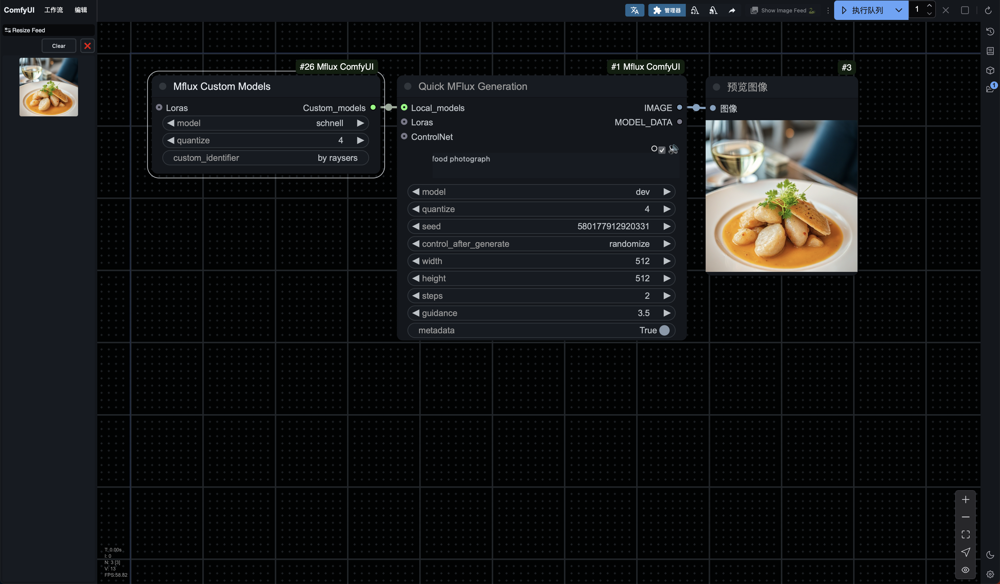

<h1 align="center">Quick Mflux on Comfyui</h1>

      中文 | <a href="README.md">English</a>

# Quick Mflux on Comfyui

## 简介
Mflux在ComfyUI中的简单使用，适合不太懂得使用终端的用户，仅MacOS。

## 特别鸣谢

感谢[**mflux**](https://github.com/filipstrand/mflux)项目的开发者们，特别是项目发起人 **@filipstrand** 和活跃贡献者 **@anthonywu**，是他们让Mac用户实现了更方便高效的flux模型生图，这些贡献着实令人轻松愉悦，谢谢他们！

mflux:
https://github.com/filipstrand/mflux

同时感谢[**MFLUX-WEBUI**](https://github.com/CharafChnioune/MFLUX-WEBUI)的作者 **@CharafChnioune**，我部分参考了他的代码，基于他的项目所使用的Apache 2.0许可证的要求，我在代码中的引用段落添加了许可证注释。

## 安装指南
1. cd /path/to/your_ComfyUI
2. 激活虚拟环境
3. cd custom_nodes
4. `git clone https://github.com/raysers/Mflux-ComfyUI.git`
5. pip install mflux==0.3.0
6. 重启ComfyUI

或者，从ComfyUI-Manager中直接搜索“Mflux-ComfyUI”来快速安装。

## 更新声明

**关于本次更新：**

1.找回了上次更新所放弃的Huggingface自动下载功能，方便用户直接下载既有的Mflux 4bit模型。

同时根据issue#04中的探讨，添加了8bit的版本，解决用户手动下载的难题，现在所有量化模型皆可通过**Mflux Models Downloader**节点来直接下载。

这里也给出所有量化版本的手动下载地址：

- [madroid/flux.1-schnell-mflux-4bit](https://huggingface.co/madroid/flux.1-schnell-mflux-4bit)
- [madroid/flux.1-dev-mflux-4bit](https://huggingface.co/madroid/flux.1-dev-mflux-4bit)
- [AITRADER/MFLUX.1-schnell-8-bit](https://huggingface.co/AITRADER/MFLUX.1-schnell-8-bit)
- [AITRADER/MFLUX.1-dev-8-bit](https://huggingface.co/AITRADER/MFLUX.1-dev-8-bit)

2.尝试补全了Mflux0.3.0的最后一块拼图，即保存用户专属模型。拥有了这个功能，只要您的.cache中保存有完整的黑森林原生模型，您就可以设置参数来自由定制属于您自己的专属模型。下载也就变得鸡肋了，因为自己动手丰衣足食。

**往期更新回顾：**

ComfyUI的loras存放路径是**models/loras**，需要手动将LORA文件放进目录里，**Mflux Loras Loader**节点将自动检索。

我的习惯是在**models/loras**下新建Mflux文件夹，用来检测Mflux所能适配的LORA，统一存放其中，因此在我的节点中，检索出来的应该是Mflux/*******.safetensors

**需要注意：**

如果对Lora的需求不大，仍然推荐继续使用之前的4BIT量化模型，只要它仍在先前版本的预设路径“**models/Mflux**”目录下，那么就可以在**Mflux Models Loader**节点列表中自由选择。

同时此次更新几乎涵盖了模型的全部加载方式，让各种需求的用户都能实现模型自由。我本人推荐的仍然是4bit Schnell 2step,在我的M1 Pro 16GB上实现了20+秒生图。

## 使用说明

右键新建节点：

**Mflux/Air**下：

- **Quick MFlux Generation**
- **Mflux Models Loader**
- **Mflux Models Downloader**
- **Mflux Custom Models**

**Mflux/Pro**下：

- **Mflux Loras Loader**
- **Mflux ControlNet Loader**

或者双击画板空白处调出节点搜索框，直接搜索节点名称，搜索关键字“Mflux”

### 流程

**Mflux Air：**

这个流程将会从Huggingface下载完整版的dev或schnell到`.cache`里。

或者外接的节点可以用来继续加载4BIT量化模型，比如：

或者你可以直接连接**Mflux Models Downloader**节点以从Huggingface下载量化模型，比如：

或者你也可以使用完整版的黑森林模型通过**Mflux Custom Models**来打造那你的专属模型：

比如默认量化版，这和Huggingface下载的基础版量化模型是一样的：

比如LORA叠加版，这可以在叠加LORA后再进行量化，从而使模型成为一种独特模型：

这种LORA定制模型的不足是它本质仍然属于量化模型，你想在**Quick MFlux Generation**里继续叠加Loras的话，它就会报错。

但是，如果你想要快速生成同一种lora风格的多张图片，并且您的机器配置不是很高，比如我的16GB，那么使用这种方法可以当做实现Lora的折中方案，生图完成的时候可以直接删除这种独特模型。

**注意**

无论是下载Huggingface的模型还是自定义专属模型，它们都仅需要运行一次，只要你保存了模型，就可以使用**Mflux Models Loader**节点来检索它们。

**Mflux Custom Models**节点中的custom_identifier不是必填项，如果不需要特定表示作区分，完全可以选择留空。

**Mflux Pro：**

Loras:

图中使用了两个**Mflux Loras Loader**节点，只是为了说明它们是可以串接的，也就是说，理论上可以加载无数Lora...

注意使用Lora的时候同样可以用**Mflux Models Loader**节点加载本地模型，但仅限完整版模型，如果模型列表中选择了量化模型，那样将会报错。

ControlNet:

Mflux的ControlNet，目前仅支持Canny

**Mflux Plus：**

英文小白们必备

图像反推再生成，这里使用MiaoshouAI/Florence-2-large-PromptGen-v1.5视觉模型

以上流程均可从workflows文件夹中直接拖入ComfyUI.

！！！节点报红色的话使用ComfyUI-Manager的“一键安装缺失节点”。
！！！请注意流程末端全部使用的是预览节点，不会自动保存，需要自己挑选满意的生成图片手动保存，或者干脆把预览节点换成保存节点。

 **Quick MFlux Generation** 节点中的metadata选项，如果它是true值（默认false），那么生成的图像将被保存到 **ComfyUI/output/Mflux** 中，同时带有图像同名的json文件，里面包含了该图像的几乎一切生成参数。
 我个人比较喜欢打开metadata为true，同时连接预览节点而不是保存节点，这样的好处是不会重复保存，而且如果日后要检索某图片的信息，可以直接json文件中查阅，方便复刻图像。
 因此这次更新中，metadata被我默认打开，如果需要关闭，只需一个点击。

### 可能的探索

**Mflux MAX:**

......

**Mflux Ultra:**

......

这里还是希望大佬们多分享工作流程，充分发扬互联网的共享精神，知识付费？不，我主张合作分享，互惠共赢。

## 规划

目前已完成了Mflux0.3.0的全部功能。请留意官网的更新：

https://github.com/filipstrand/mflux

完成Mflux0.3.0的这些工作时，我给了自己一颗星。新手项目同样需要勉励。

## 贡献

我是编码新手，这是我的第一个GitHub项目。我原本的规划十分宏大，比如实现mflux的Lora以及ControlNet功能（目前已实现Mflux ControNet仅Canny，还有Lora），以及实现ComfyUI的精髓理念——即拆分节点以让用户能够深入了解flux的底层逻辑……但我粗浅的代码能力限制了我的蓝图。如果有高手能够帮忙实现这些，我十分感谢。在此问好。

其他的贡献应当包括问题反馈，因为我惊奇地发觉这个项目居然到目前为止都是0反馈，而我有时难免疏漏，无法发现问题。比如之前曾经丢失过“}”符号，并且出现过models/Mflux目录没被自动创建的错误。此外我在ComfyUI官网上发现了一个反馈，即OS15可能不能使用。

“}”符号的解决是@eLenoAr及时提醒了我，虽然不是通过issues渠道，但同样感谢@eLenoAr在代码下的留言反馈。

## 许可证
我想采用和mflux项目一致的MIT麻省理工许可，也算为开源贡献一份心力吧。